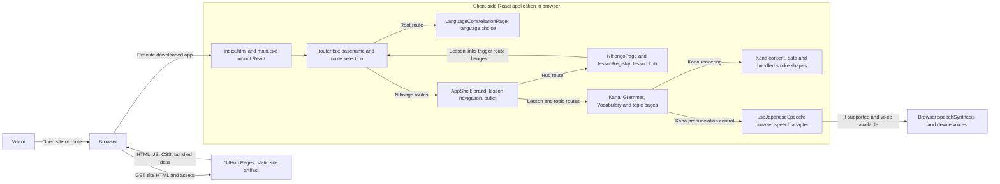
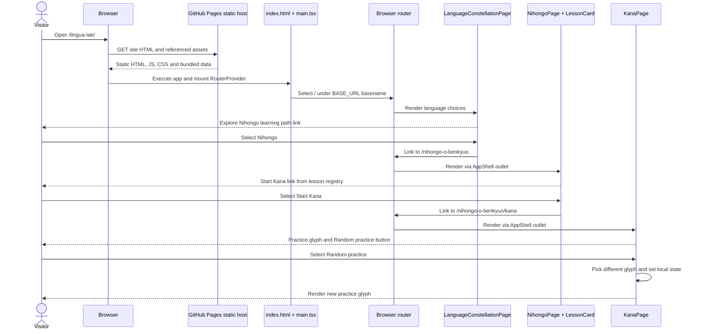
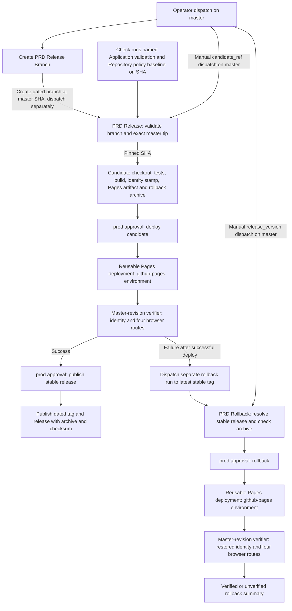

# Application architecture

## Domain and page ownership

The current feature hierarchy follows the user-facing learning path:

```text
src/
  app/                         Application shell and route setup
  business/
    language-home/              Language selection home
      nihongo/                  Nihongo lesson hub and lesson registry
        kana/                   Kana reference, practice, content, and behavior
```

The former `lesson-lobby` feature folder is no longer part of the current source tree. Nihongo and its lesson features are owned under `business/language-home/nihongo/`.

## Routing

`src/app/main.tsx` mounts `RouterProvider` with the `createBrowserRouter` in `src/app/router.tsx` (not the separate `App.tsx` component used in unit tests). The language home lives at `/`; the Nihongo hub is at `/nihongo-o-benkyuo`, with `/kana`, `/grammar`, `/grammar/first-introductions`, `/vocabulary`, and `/vocabulary/first-introductions` beneath it. The older `/lessons/kana` address redirects to the nested Kana route. Unmatched client-side routes render the not-found view inside the shell.

`AppShell` provides the shared brand and lesson navigation for the Nihongo routes. Lesson metadata is defined once in `nihongo/lessonRegistry.ts`; the hub and navigation read it to show the available lessons (all three current registry entries are available; the UI also supports a coming-soon status).

## Runtime request and component boundaries

The deployed artifact is static HTML, CSS, JavaScript, and the bundled lesson data/stroke assets. GitHub Pages hosts the artifact; React and route selection run in the visitor's browser. No application backend or app-owned API is configured in the inspected entry, router, features, dependencies, and Pages deployment configuration. Kana pronunciation uses the browser's `speechSynthesis` API and an available Japanese voice, not an application service; voice availability and actual playback depend on the visitor's browser/device. Build and deploy jobs are not runtime services.



Boundary evidence: [Pages artifact build](../.github/workflows/prd-release.yml), [Pages deployment](../.github/workflows/wc-release-pages.yml), [Vite base](../vite.config.ts), [HTML entry](../index.html), [React mount](../src/app/main.tsx), [router](../src/app/router.tsx), [home](../src/business/language-home/LanguageConstellationPage.tsx), [shell](../src/app/AppShell.tsx), [hub](../src/business/language-home/nihongo/NihongoPage.tsx), [registry](../src/business/language-home/nihongo/lessonRegistry.ts), [Kana](../src/business/language-home/nihongo/kana/KanaPage.tsx), [Grammar](../src/business/language-home/nihongo/grammar/GrammarPage.tsx), [Vocabulary](../src/business/language-home/nihongo/vocabulary/VocabularyPage.tsx), [Kana data](../src/business/language-home/nihongo/kana/data/kana.ts), [stroke assets](../src/business/language-home/nihongo/kana/components/KanaWritingGuide.tsx), and [browser speech hook](../src/business/language-home/nihongo/kana/hooks/useJapaneseSpeech.ts). The topic pages are [Grammar first introductions](../src/business/language-home/nihongo/grammar/FirstIntroductionsPage.tsx) and [Vocabulary first introductions](../src/business/language-home/nihongo/vocabulary/FirstIntroductionsVocabularyPage.tsx). The hub links to lessons via [LessonCard](../src/business/language-home/nihongo/LessonCard.tsx); `AppShell` renders them via its outlet.

### Representative interaction: choose and practise Kana

This is a normal in-app navigation from the home URL, not a hard refresh on a deep link. The random button updates local React state; the interaction does not request lesson data from a server.



Flow evidence: [entry](../index.html), [mount](../src/app/main.tsx), [router routes/basename](../src/app/router.tsx), [home Link](../src/business/language-home/LanguageConstellationPage.tsx), [shell outlet](../src/app/AppShell.tsx), [hub](../src/business/language-home/nihongo/NihongoPage.tsx), [lesson registry](../src/business/language-home/nihongo/lessonRegistry.ts), [lesson link](../src/business/language-home/nihongo/LessonCard.tsx), and [Kana selection/button/state](../src/business/language-home/nihongo/kana/KanaPage.tsx). [Browser smoke coverage](../e2e/smoke.spec.ts) exercises the home → hub → Kana route and random practice independently.

## Kana feature structure

`business/language-home/nihongo/kana/` keeps the page composition close to its feature-specific parts:

- `KanaPage.tsx` composes the basics guide, inline practice controls, reference tables, and sound-mark sections.
- `components/` contains visual and interactive units, including the stroke-order writing guide; `PracticeCard.tsx` and `SpeechButton.tsx` exist but are not mounted by `KanaPage.tsx`.
- `data/` and `content/` hold Kana entries and learning copy.
- `hooks/` encapsulates browser Japanese speech behavior.
- `lib/` contains selection logic tested independently; `KanaPage.tsx` currently uses its own `selectPractice` function instead.
- `types/` defines Kana and sound-mark data shapes.

Unit tests sit beside the feature and its components; browser smoke tests live in `e2e/`.

## Asset base path and GitHub Pages

Vite uses `/` when `GITHUB_ACTIONS` is unset and `/lingua-lab/` when it is set. The production workflow sets `GITHUB_ACTIONS=true` for `npm run build` and uploads `dist` as the Pages artifact. React Router uses Vite's `BASE_URL` as its basename. The deployed `public/404.html` script redirects missing deep paths under `/lingua-lab/` to the base URL with `?p=` (and optional `h` for the hash); `src/app/router.tsx` then restores that path with `history.replaceState` before creating the router and rejects external-origin fallback targets. This depends on the static host serving the built `404.html` for missing paths; the repository's `e2e/pages-server.mjs` models that behavior, and `e2e/smoke.spec.ts` covers a Kana refresh against that test server. Live Pages behavior beyond the configured workflow is not established here.

Use router links and base-aware asset URLs rather than hard-coded root-relative paths. The configured project path is part of the production deployment contract; see [CI/CD](ci-cd.md) for the release workflow and environment gates.

## Production release and rollback boundaries (configured, not a live-release assertion)

The production control plane is GitHub Actions, GitHub Releases, and GitHub Pages, separate from the browser runtime above. The following is the **current worktree configuration**, not proof that repository protection settings are active or that a production run succeeded. Manual dispatch is possible as well as the branch-creator dispatch. The diagrams show job dependencies, not an atomic transaction or an exclusive deployment lock.



### Candidate lineage, approval, and execution

The [branch creator](../.github/workflows/prd-create-release-branch.yml) currently has a YAML job guard for `refs/heads/master` and retains `contents: write` as requested. Because the guard and permission are part of the same caller-selected workflow revision, a different ref could change the guard; no independent GitHub dispatch-ref restriction was added, so this trust-boundary risk remains unresolved. [create-branch.sh](../scripts/release/create-branch.sh) rejects existing dated branch/tag/release names and creates the branch at the master SHA resolved at that step. It dispatches `prd-release.yml` at `master`, but does not pass the SHA: the separate release run resolves the branch again. Manual release dispatch is also allowed with `candidate_ref`. [validate-candidate.sh](../scripts/release/validate-candidate.sh) accepts only `release/homelab/YYYYMMDD` with a valid date, resolves its full commit SHA, rejects an existing tag/release, requires that SHA to equal the then-current master tip, and queries check runs on that SHA for successful `Application validation` and `Repository policy baseline` names. [CI](../.github/workflows/ci.yml) configures push-to-master and PR-to-master jobs with those names. Release build checks out the validated SHA and runs lint, typecheck, unit tests, three-browser smoke tests and build before creating the Pages artifact. This is an exact-SHA comparison **at validation time**, not a continuing master-tip lock or proof of the branch's creation history.

GitHub branch protection for `master` was read back on 2026-09-29: strict required checks are `Application validation` and `Repository policy baseline`, one approving PR review is required, stale approvals are dismissed, approval of the latest push is required, admins are included, and conversation resolution is required. This confirms the live configuration at that time, not a particular PR's approval or successful checks; re-read it for a future release. The [repository policy script](../scripts/verify-repo-policy.mjs) checks only bootstrap configuration and leaves human PR approval and successful PR CI as operator-verified preconditions. The [release gate](../.github/workflows/release-gate.yml) also states that current-head review/required-check aggregation is not enabled. Do not treat a green workflow name alone as authorization to release.

On an intended `master` dispatch, the release validation and production-verification jobs check out code at the run's `${{ github.sha }}`, while the build job checks out the candidate SHA and executes its repository code, tests, lockfile dependencies, and local composite action. The `master` job guard is part of the workflow YAML, not independent enforcement of caller-selected dispatch refs; see the unresolved branch-creator trust boundary above. Equality with master at validation limits that exposure to the accepted master tip at that moment; it does **not** isolate the build from candidate-controlled executable content. The release verification job checks out the dispatch's master `github.sha` for its verifier, setup action and dependencies, not the candidate branch ref. Rollback now checks out the dispatch's `github.sha` for both target resolution and verification, keeping those scripts pinned to the same workflow revision. These are workflow checkout boundaries, not an independently immutable or externally audited verifier.

### Artifact/source identity and rollback

The [release workflow](../.github/workflows/prd-release.yml) writes `dist/release-identity.json` containing the validated `sourceSha` **after** build, then packages `dist` as `site-dist.tar.gz` with a SHA-256 checksum. It separately uploads `dist` to Pages and retains the archive/checksum as a run artifact until publication. After the first `prod` approval, [wc-release-pages.yml](../.github/workflows/wc-release-pages.yml) deploys the caller's Pages artifact in `github-pages`. The [production verifier](../scripts/release/verify-deployed-site.mjs) fetches `release-identity.json` at the reported deployment URL and compares `sourceSha`; Chromium checks homepage, Kana, Grammar, and Vocabulary responses, visible level-one headings, and final pathnames. Only a successful verification followed by a **second** `prod` approval enables [stable publication](../scripts/release/publish-stable-release.sh), which targets the validated SHA and attaches the retained archive and checksum to the dated GitHub Release. These gates are configured in YAML; required-reviewer settings and approval events require separate live evidence.

The identity file is a build stamp, not a cryptographic proof that the served bytes equal the archive or that all assets came from that commit. The archive and Pages upload are made from the same `dist` directory but use separate packaging/upload paths; neither a deployed-content digest nor an independently trusted artifact attestation is checked. Route checks sample four paths, not the whole site. Production identity and route results may also change after verification if another run deploys.

On release verification **failure after a successful deploy job**, [dispatch-rollback.sh](../scripts/release/dispatch-rollback.sh) requests a separate rollback run against GitHub's latest published stable release; dispatch is not proof of restored production. No rollback is dispatched by this condition for a deploy-job failure, a skipped/cancelled verifier, or absent valid stable target. Manual rollback accepts a dated `release_version`. [resolve-rollback-target.sh](../scripts/release/resolve-rollback-target.sh) requires a published non-draft, non-prerelease dated release, downloads its attached archive/checksum, validates SHA-256 and a root `index.html`, and resolves the release tag's commit. After `prod` approval, the Pages artifact is redeployed. [verify_rollback](../.github/workflows/prd-rollback.yml) runs the same identity and four-route verifier against the deployment URL, comparing the served stamp to the **current commit resolved by the tag**. The rollback summary says `Rollback verified` only if deploy and verification jobs both succeed; otherwise it marks recovery unverified and calls for manual intervention. The checksum is stored alongside the archive in the same GitHub Release, so this check detects mismatch between those assets but does not establish an independently trusted signature or bind archive bytes to the tag's commit. Rollback changes the Pages artifact, not source history.

### Deployment serialization and unresolved controls

The [release](../.github/workflows/prd-release.yml) and [rollback](../.github/workflows/prd-rollback.yml) workflows share the workflow-level concurrency group `lingua-lab-production` with `queue: max` and no `cancel-in-progress`. This serializes runs across each complete workflow, including time waiting at `prod` approval gates and post-deployment verification. GitHub permits up to 100 pending runs in the group; once that capacity is reached, further runs are canceled. Ordering is based on when a run starts waiting, not guaranteed to match dispatch-time order, and this is not a durable queue. The [reusable deploy workflow](../.github/workflows/wc-release-pages.yml) has no separate deployment mutex. Serialization prevents these grouped workflow runs from proceeding concurrently, but does not guarantee that verified content remains active after the run completes or that all production deployments use this group. Default should still resolve check-run provenance, live branch/environment protections, and archive-to-source assurance before describing these as enforced guarantees.

Control-plane evidence: [CI](../.github/workflows/ci.yml), [release gate](../.github/workflows/release-gate.yml), [branch creator](../.github/workflows/prd-create-release-branch.yml), [release](../.github/workflows/prd-release.yml), [rollback](../.github/workflows/prd-rollback.yml), [Pages deploy](../.github/workflows/wc-release-pages.yml), [candidate validation](../scripts/release/validate-candidate.sh), [rollback resolution](../scripts/release/resolve-rollback-target.sh), [rollback dispatch](../scripts/release/dispatch-rollback.sh), and [site verification](../scripts/release/verify-deployed-site.mjs). [CI/CD](ci-cd.md) describes operational gates; its statements about live environment settings are not independently verified by this architecture inspection.
